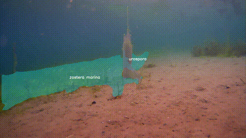
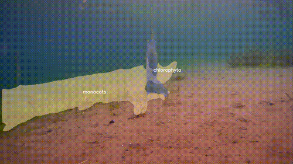
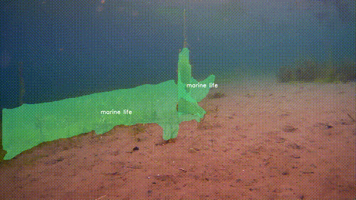

# FjordVision Hierarchical Classification Model

This GitHub repository contains the code implementation for our paper:

📄 **Marine Vegetation Analysis in Esefjorden, Norway using Hierarchical CNN-based Classification**  
Published in *ScienceDirect*  
[DOI: 10.1016/j.ecoinf.2024.102567](https://www.sciencedirect.com/science/article/pii/S1574954124005089)

## Demo: Taxonomic Classification at Different Levels

Explore our hierarchical classification models across various taxonomic ranks:

### Species Level


### Class level


### Binary level


## Description
The FjordVision project explores the impact of various alpha regularization parameters on the performance of hierarchical classification models using a self developed marine dataset and the COCO dataset. This project aims to determine how model configurations affect the recognition capabilities for categories such as marine species and vehicles in the COCO dataset.

## Table of Contents
- [Installation](#installation)
- [Usage](#usage)
- [Project Structure](#project-structure)
- [Detailed Documentation](#detailed-documentation)

## Installation
To set up your environment for running these experiments, follow these steps:
```bash
# Clone the repository
git clone https://github.com/bcwein/FjordVision.git

# Navigate to the project directory
cd FjordVision

# Create and activate a virtual environment
python3 -m venv fjordvision
source fjordvision/bin/activate

# Install required dependencies
pip install -r requirements.txt
```

## Usage

This section outlines the necessary steps to utilize the project for running our code with pre-trained models and experimental data.

### Download datasets and experimental data

Run the script

```bash
./setup-and-download.sh
```
This script will download the following:

- **Esefjorden Marine Vegetation Segmentation Dataset (EMVSD)**:
    - Contains 17,000 annotated images of marine vegetation and fauna collected from Esefjorden, Norway.
    - Annotations are provided in:
        - YOLO txt format for object detection.
        - COCO mask format for instance segmentation.

- **Pre-Trained Model Weights**:
    - Includes pre-trained weights for object detection models trained on the EMVSD dataset:
        - YOLOv8
        - YOLOv9
        - RT-DETR
        - MaskRCNN

- **Hierarchical Classification Datasets**:
    - Organized as a combination of:
        - Parquet files containing metadata for segmented objects, including:
            - `masked_image`: Path to the segmented image file.
            - `confidence`: Confidence score for the prediction.
            - `predicted_species`: Predicted species label.
            - `species`: True species label.
        - Folders of segmented images corresponding to the detected objects.

- **Trained Hierarchical Classification Models**:
    - Weights for hierarchical CNN models trained using EMVSD dataset outputs.
    - Includes alpha-regularized models for fine-tuned performance.

- **Segmented Object Outputs**:
    - Segmentation outputs from trained models, organized by model type:
        - **MaskRCNN**:
            - Segmented images: `maskrcnn-segmented-objects/`
            - Metadata: `maskrcnn-segmented-objects-dataset.parquet`
        - **RT-DETR**:
            - Segmented images: `rtdetr-segmented-objects/`
            - Metadata: `rtdetr-segmented-objects-dataset.parquet`
        - **YOLOSAG**:
            - Segmented images: `yolosag-segmented-objects/`
            - Metadata: `yolosag-segmented-objects-dataset.parquet`
        - **YOLOv11**:
            - Segmented images: `yolov11-segmented-objects/`
            - Metadata: `yolov11-segmented-objects-dataset.parquet`
        - **YOLOv8**:
            - Segmented images: `yolov8-segmented-objects/`
            - Metadata: `yolov8-segmented-objects-dataset.parquet`
        - **YOLOv9**:
            - Segmented images: `yolov9-segmented-objects/`
            - Metadata: `yolov9-segmented-objects-dataset.parquet`

### Alternative Manual Download

If you prefer to download datasets and experimental data manually, visit the Figshare repositories:
- [Esefjorden Marine Vegetation Segmentation Dataset (EMVSD)](https://doi.org/10.6084/m9.figshare.24072606.v4)
- [Experimental Data and Model Weights](https://doi.org/10.6084/m9.figshare.25688718.v3)


### Run our model on video

If you want to run inference with our models on a video stream use the following
command

```bash
python3 scripts/run_classification_stream.py --display_level="species" --output_path="demo/output-species.mp4"
```

Available hierarcical levels are "species", "genus", "class", "binary".

### Run experiments and gather F1 scores

This is done by running the notebook `run-experiments.ipyn`

### Visualise activations and class activiations

This is done by running the notebook `hierarcical-cnn-visualisation.ipyn`

## Project Structure

- **datasets/**: Contains the EMVSD, including segmented images and model weights.
- **demo/**: Demo videos and GIFs for visualizing model outputs.
- **fjordvision/**: Python virtual enviromnent
- **models/**: Definitions of the hierarchical models.
- **preprocessing/**: Scripts for data preprocessing, dataset creation and model training.
- **scripts/**: Utility scripts for setting up the environment, downloading data, and running the models.
- **utils/**: Helper functions and utilities for model operation and data manipulation.
- **experimental-data.ipynb**: Jupyter notebook for initial data analysis.
- **hierarchical-cnn-visualisation.ipynb**, **run-experiments.ipynb**: Notebooks for running experiments and visualizing model performance.

## Detailed Documentation

For more in-depth documentation of the modules and code, see the following links:
- [BranchCNN Model Documentation](docs/branch_cnn.md)
- [HierarchcialCNN Model Documentation](docs/hierarcical_cnn.md)
